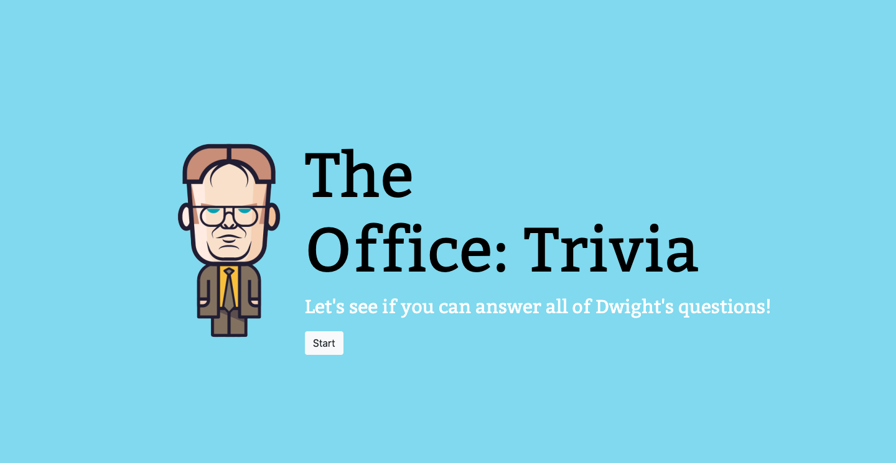
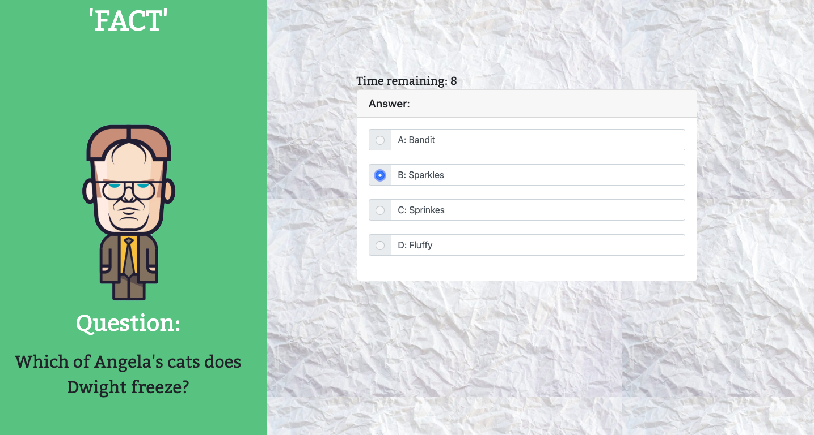
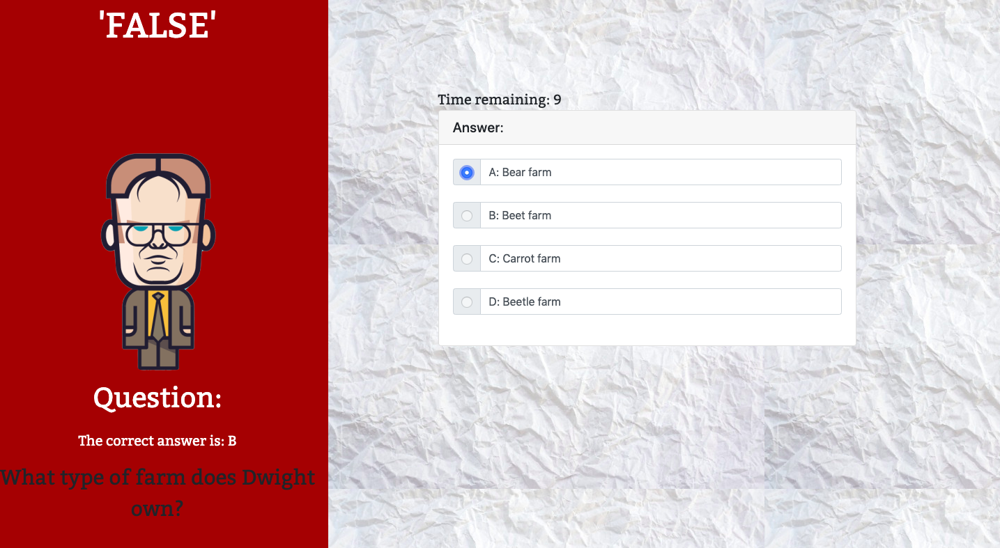
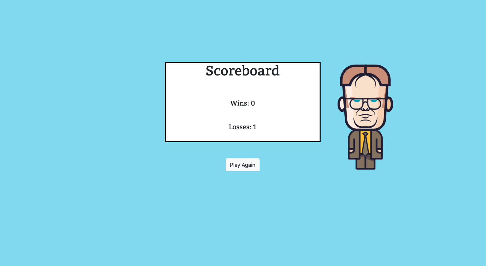

# TriviaGame

## Pictures of Site
Initial page:

Page when a player answers correctly:

Page when a player answers incorrectly: 

Scoreboard for when the player is finished answering all questions:

## Description of Site
A hangman game for the purpose of:  
1. Practicing newly learned skills in javascript

## Technologies Used
1. HTML 
2. CSS
3. Bootstrap
4. Javascript
5. jQuery - Timers

## Author(s): [Minori Hashimoto](https://github.com/minori-fh)